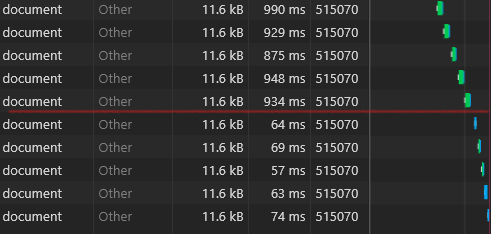

# Wivuu.GlobalCache
[](https://github.com/wivuu/Wivuu.GlobalCache/actions?query=workflow%3ATests)
[](https://www.nuget.org/packages/Wivuu.GlobalCache/)
[](https://www.nuget.org/packages/Wivuu.GlobalCache.AzureStorage)
[](https://www.nuget.org/packages/Wivuu.GlobalCache.BinarySerializer)


The GlobalCache library endeavors to provide a cheap and effortless way to host a distributed caching mechanism.

This is a great fit if:
- You want to keep costs down by avoiding use of VMs or services like Redis.
- The API surface area is sufficient for your needs (GetOrCreate and Invalidate).
- You write to/update a datasource infrequently, but querying and aggregating data out is common and CPU/memory/database intensive; simply call `InvalidateAsync` on the cache whenever a write happens and then `GetOrCreate` in the distributed consumer so that the aggregation logic only happens once per write.



*The above sample demonstrates pulling data from the database and processing it (above the red line) vs. downloading pre-cached 100kb from premium blob storage (below the red line)*

## TODO
- Create github actions to publish releases
- Create nuget packages / publishing process
- Support IAsyncEnumerable in storage providers and global cache to stream data from storage
- Allow raw storage and response, for example if you store as JSON and an ASPNET response is JSON, you could avoid an extra deserialize/serialize step by storing in UTF8 JSON and returning that directly to the client

## Azure Blob Storage
Using azure blob storage provider you can utilize Premium Block Blob to get consistent low latency, datacenter local cache that can be shared across many instances of your application or even by Azure Functions. You can configure Lifecycle Management on your container to automatically expire categories of cached item and detect changes to your cache using the change feed or azure function blob triggers. 

## Installation

This library can be installed via NuGet:

```sh
# Install the core library; includes filesystem adapter & JSON serializer
dotnet add package Wivuu.GlobalCache 

# Or install the azure storage adapter directly
dotnet add package Wivuu.GlobalCache.AzureStorage # Install Azure Storage adapter
dotnet add package Wivuu.GlobalCache.BinarySerializer # Install Binary Serialization adapter
```

## Usage with DependencyInjection

Using standard Microsoft DI, GlobalCache can be included in your `Startup.cs`

```C#
using Wivuu.GlobalCache;
using Wivuu.GlobalCache.AzureStorage;
using Wivuu.GlobalCache.BinarySerializer;

public void ConfigureServices(IServiceCollection collection)
{
    // ...

    // Adds with default settings
    collection.AddWivuuGlobalCache();

    // OR configure additional settings
    collection.AddWivuuGlobalCache(options =>
    {
        // Use local storage emulator 
        var blobServiceClient = new BlobServiceClient("UseDevelopmentStorage=true");
        var container         = blobServiceClient.GetBlobContainerClient("globalcache");

        // Create a storage container if it doesnt exist
        container.CreateIfNotExists();

        // Use blob storage provider
        options.StorageProvider = new BlobStorageProvider(container);

        // Use binary serialization provider
        options.SerializationProvider = new BinarySerializationProvider();
    });
}
```

## Usage in a controller

Once the global cache has been configured, it can be included using standard DI

```C#
[HttpGet]
public async Task<ActionResult<string>> GetExpensiveItemAsync([FromServices]IGlobalCache cache, 
                                                              [FromQuery]string name) =>
    // If the result is already cached, it will retrieve the cached value, otherwise
    // the (potentially expensive) provided generator function will be invoked and then the
    // result will be stored for future use
    await cache.GetOrCreateAsync(new CacheId("expensiveitems", name), async () =>
    {
        // Simulate hard work!
        await Task.Delay(5_000);

        // Or, you know, retrieve 1,000,000 items from a database and execute
        // expensive aggregation formulas no the resulting data and return it.

        return $"Hello {name}!";
    });

[HttpPut]
public async Task PutInvalidationAsync([FromServices]IGlobalCache cache) =>
    // Invalidate all names stored in the cache
    await cache.InvalidateAsync(CacheId.ForCategory("expensiveitems"));
```